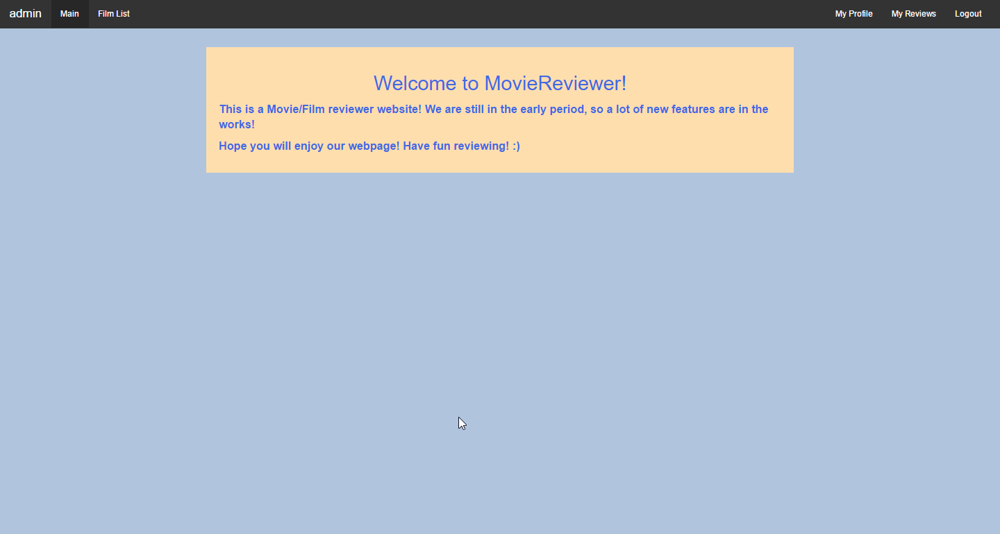
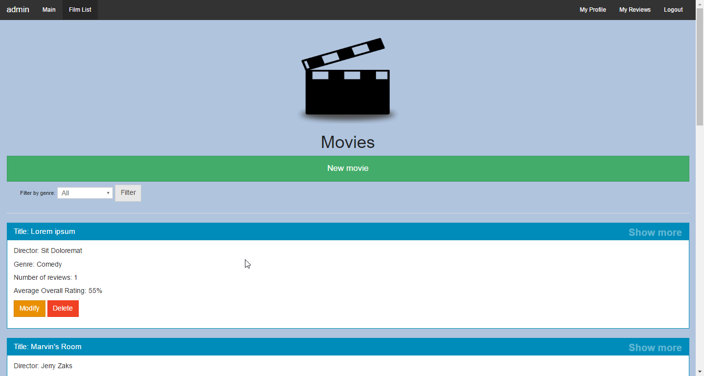
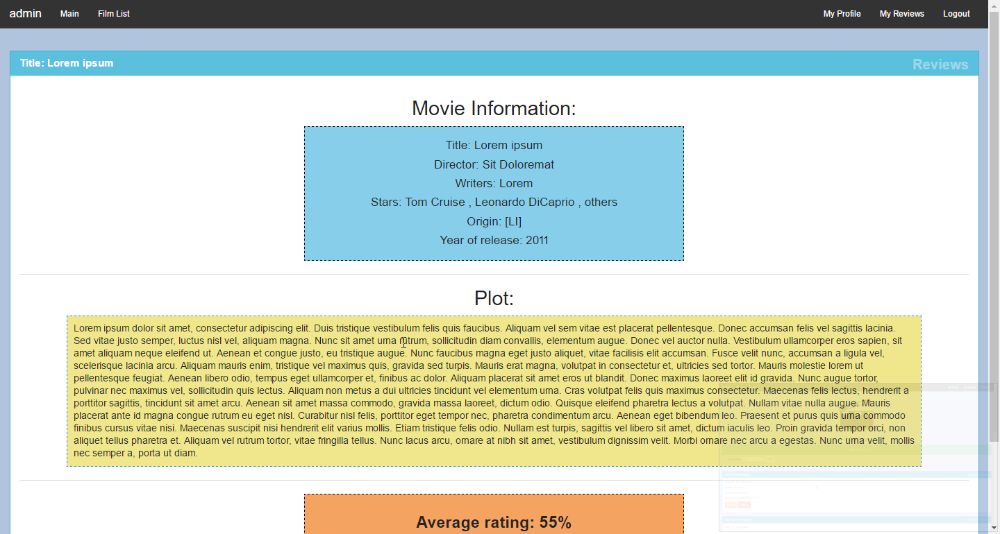
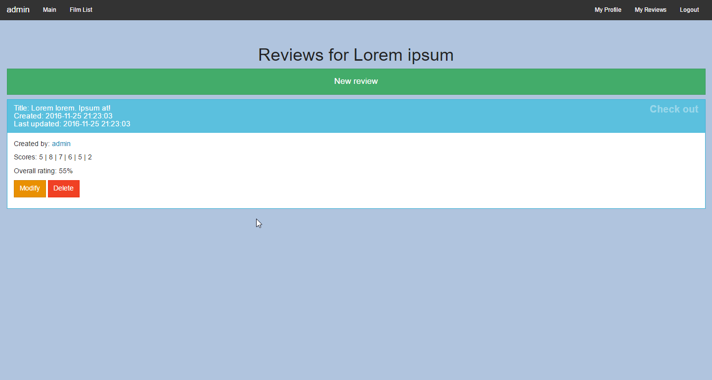
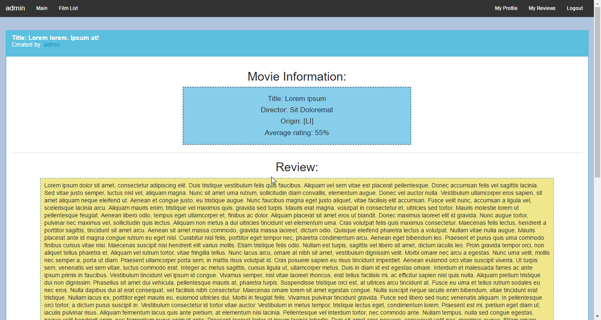
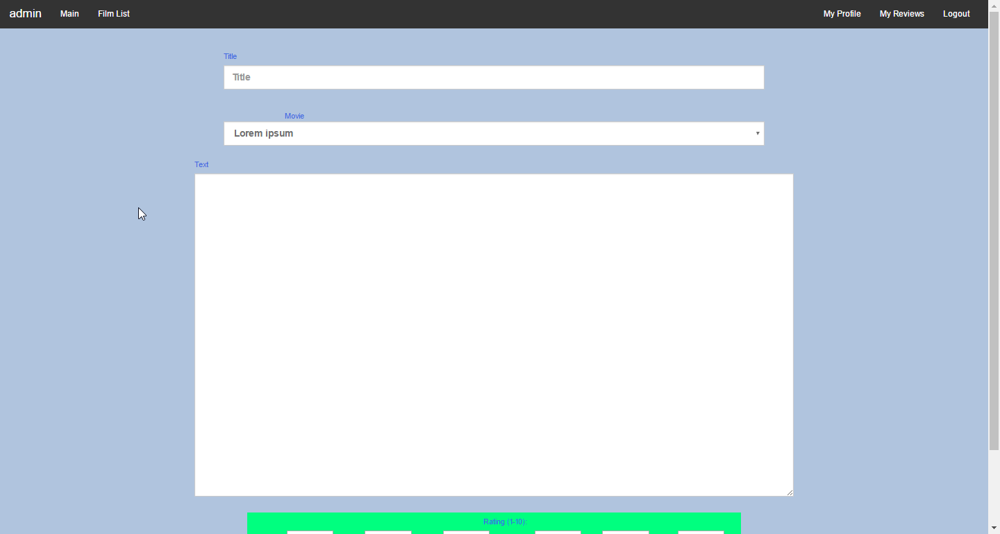

# MovieReviewer
Egy egyszerű (imdb-szerű) filmelemző oldal, ahol filmekről lehet bemutatókat, értékeléseket írni, ajánlási és pontozási rendszerrel.

# Teszteléshez
* Admin: 
 - Felhasználónév: admin
 - Jelszó: admin

# Konfigurálás

* Függőségek telepítése: npm i
* .env.example átnevezése .env-re, és tartalmának ellenőrzése
* Indítás: npm start vagy npm run dev

# Követelményanalízis

## Funkcionális elvárások

### Adminisztrátoroknak
#### Adminisztráció
- Új filmek felvétele az értékelhető filmek közé
- Főoldali bejegyzések kiírása

#### Moderálás
- Filmelemzések szövegének módosítása
- Filmelemzések törlése
- (Mindenhol) Hozzászólások törlése
- (Mindenhol) Hozzászólások módosítása

### Felhasználóknak
#### Profilkezelés
- Profiladatok szerkesztése (email, jelszó, bemutatkozás)
- Profilértékelések megtekintése (mennyien tekintették hasznosnak a bemutatóit, melyik a legelismertebb bemutatója)

#### Filmelemzések
* Új elemzése hozzáadása:
  - Film kiválasztása
  - Értékelés megadása: 
    * Összpontszám (Átlagolja a többiből)
    * Külön pontokra szedve 
      * Történet
      * Zene/Hang
      * Színészi játék
      * Vizualitás
      * Szinkron
  - Ismertető szöveg írása
    * Beilleszthetőek képek illusztrációképpen
* Előző elemzések módosítása
* Előző elemzések törlése

#### Hozzászólások
- Hozzászólások írása más felhasználók elemzéseihez
- Más felhasználók hozzászólásainak '+1'-ezése (Egyetért) vagy '-1'-ezése (Nem ért egyet)
- Saját filmismertetőkhöz írt hozzászólások moderelása

### Vendégeknek
- Regisztráció, bejelentkezés
- Filmismertetők hasznosnak jelölése
- Keresés a filmek között cím, rendező, év, studió, műfaj szerint
- Pontozások alapján a filmek listázása

## Nem funkcionális követelmények
- Felhasználóbarát, ergonomikus elrendezés és kinézet.
- Gyors működés.
- Jelszavak tárolása, funkciókhoz való hozzáférés, biztonságos működés.
- Filmértékelések tárolásához elegendő háttértár

## SZAKTERÜLETI FOGALOMJEGYZÉK

Filmismertető: Egy hosszabb terjedelmű szöveges véleménykifejzés egy filmről. Pontokra szedve vagy folyamatosan egyben, ez a felhasználótól függ.

Értékelés: Egy egész szám 1-től 5-ig, amivel a film adott jellemzőjét(a fentebb felsoroltakra bontva) osztályozza a felhasználó

# Tervezés
### Felépítés

**Oldaltérkép:**

+ **Publikus:**
  + Kezdőlap
  + Bejelentkezés
  + Regisztráció
  + Filmek listázása
    + Film megtekintése 
      + Bemutatók listázása
        + Bemutató megtekintése
        
+ **Bejelentkezett Felhasználónak:**
  + Kezdőlap
  + Filmek listázása
    + Film megtekintése
      + Bemutatók listázása
        + Bemutató megtekintése
      + Bemutató hozzáadása
  + Saját bemutatók listázása   
    + Bemutató hozzáadása
    + Bemutató megtekintése
    + Bemutató törlése
    + Bemutató szerkesztése
  + Kijelentkezés

+ **Bejelentkezett Adminisztrátoroknak:**
  + Kezdőlap
  + Filmek listázása
    + Új film hozzáadása
    + Film szerkesztése
    + Film törlése
    + Film megtekintése
      + Bemutatók listázása
        + Bemutató szerkesztése
        + Bemutató törlése
        + Bemutató megtekintése
      + Bemutató hozzáadása
  + Saját bemutatók listázása   
    + Bemutató hozzáadása
    + Bemutató megtekintése
    + Bemutató törlése
    + Bemutató szerkesztése
  + Kijelentkezés

**Végpontok**

+ **GET/**: főoldal
+ **GET/login**: bejelentkező adatok felküldése
+ **GET/register**: regisztrációs oldal
+ **GET/registraion**: regisztrációs adatok felküldése
+ **GET/logout**: kijelentkezés kezelése 
+ **GET/reviews**: saját bemutatók oldal
+ **GET/profile**: profil oldal
+ **POST/movies**: filmek listája oldal
+ **GET/new_review**: új bemutató oldal
+ **POS/create_review**: új bemutató adatainak felküldése
+ **GET/delete_r/:id**: bemutató törlése
+ **GET/modify_r/:id**: bemutató szerkesztése
+ **POST/edit_r/:id**: szerkesztés felküldése 
+ **GET/new_movie**: új film felvétele
+ **POST/create_movie**: új film adatainak felküldése
+ **GET/delete_m/:id**: film törlése
+ **GET/modify_m/:id**: film szerkesztése
+ **POST/edit_m/:id**: szerkesztés adatainak felküldése
+ **GET/filter**: Film lista szűrése 
+ **GET/movie/:id/reviews**: A kiválasztott filmhez tartozó bemutatók listázása
+ **GET/new_review/:id**: Új bemutató készítése
+ **GET/review/:id**: Egy bemutató megtekintése
+ **GET/movie/:id/show**: Egy film adatainak megtekintése

### Felhasználóifelület-modell

### Osztálymodell

+ **Adatmodell**

+ **Adatbázisterv**

+ **Állapotdiagram**

# Implementáció
## Fejlesztői környezet bemutatása

### Felhasznált eszközök
- Git verziókezelő
- Node.js Javascript környezet
- AdonisJS MVC keretrendszer
- Github a projekt közzétételéhez
- Sqlite3 adatbáziskezeő

#### Git - GitHub
* Telepítéshez: https://git-scm.com/
* Githubos felhasználói fiók regisztrálása 

### Összeállítás

1. Node.js telepítése: https://nodejs.org/
2. Projekt klónozása lokális gépre: git clone link.git
3. A függőségek telepítése: npm i
4. Indítás: npm start vagy npm run dev

#### SQLite adatbáziskezelő

- express-adminnal megtekinthető:
  * Telepítés: npm i express-admin
  * Konfigurálás / indítás: npm run sqladmin
  * Adatbázis típusa: sqlite
  * Adatbázisfájl: database/database.sqlite

## Könyvtárstruktúrában lévő mappák funkciójának bemutatása

* `app` Alkalmazás logika
  * `Commands` ace parancsok
  * `Http` HTTP specifikus alkalmazás logika
    * `Controllers` HTTP kérések kezelése
    * `Middleware` HTTP kérések kezelése előtt végrehajtandó
  * `Listeners` Bejövő kérések figyelése
  * `Model` Modell osztályok, logika, működés
  * `Services` Komponensek
  * `Traits` Modellek kiterjesztése
* `bootstrap` Az app indulásához szükséges műveletek, konfigurációk
* `config` Az app működését befolyásoló konfigurációs fájlok
* `database` Adatbázissal kapcsolatos
  * `migrations` Adatbázis migrációk, séma meghatározása
  * `seeds` Adatbázis seederek, példa/tesztadatok beszúrása
* `providers` Providerek
* `public` A webszerver által közvetlenül kiszolgált fájlok
* `resources` Az app által felhasznált egyéb fájlok
  * `views` Nunjucks template fájlok
* `storage` Felhasználók által feltöltött anyagok tárolására
 
# Tesztelés

## Selenium IDE

Az UI tesztek a Selenium IDE Firefox pluginnel készültek, és ezzel el is indíthatók. Ez egy olyan rendszer, ami felhasználói tevékenységet szimulál a böngészőben (pl. kattintás, gépelés, stb).

Adjuk hozzá a Firefoxhoz a fenti bővítményt. A bővítmény ablakában a Base URL helyére írjuk be az app URL-jét (alapesetben http://localhost:3333/).

Tesztek futtatásához először nyissunk meg egy test suit-ot a tests/selenium könyvtárból: Fájl >> Open Test Suite
(a kiterjesztés nélküli fájlok a suite-ok, a .html fájlok pedig a test case-ek)

A bal oldali listában megjelennek a test case-ek. A Play entire test suite gombbal lejátszhatjuk az összeset egymás után, a Play current test case gomb pedig az aktuálisan kijelölt teszteset elindítására szolgál.

## Tesztek
* loginSuite
  - Login teszt
  - Logout teszt
  - Bad Login teszt

* AssertVer
  - Assert-Verify Teszt

* reviewLogic
  - Ismertető készítése teszt
  - Ismertető törlése teszt

* movieCheck
  - Film bejegyzése teszt
  - Film törlése teszt 

# Felhasználói dokumentáció

